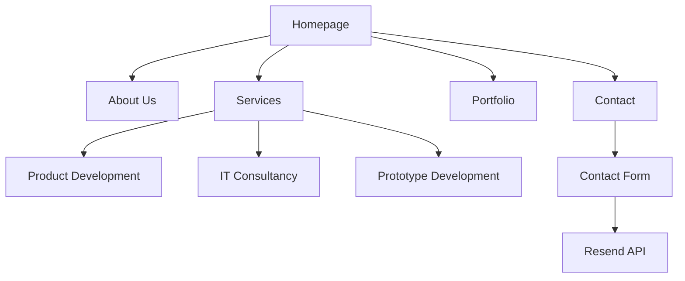

# Aphilas Studio AB - Website Development Plan

## Overview

Build a complete website for Aphilas Studio AB, an IT consultancy company specializing in:

- Product Development
- IT Consultancy
- Prototype Development

**Tech Stack:**

- Next.js 14 (App Router)
- TypeScript
- Tailwind CSS
- Framer Motion (animations)
- Resend (email integration)
- Cloudflare Pages (deployment)

**Design:**

- Dark theme with orange/red accent gradients
- Modern, professional aesthetic
- Responsive across all devices

---

## Site Architecture



---

## File Structure

```
src/
├── app/
│   ├── layout.tsx              # Root layout with header/footer
│   ├── page.tsx                # Homepage
│   ├── globals.css             # Global styles
│   ├── about/
│   │   └── page.tsx            # About Us page
│   ├── services/
│   │   └── page.tsx            # Services overview page
│   ├── portfolio/
│   │   └── page.tsx            # Portfolio/Projects page
│   ├── contact/
│   │   └── page.tsx            # Contact page with form
│   └── api/
│       └── contact/
│           └── route.ts        # Contact form API endpoint
│
├── components/
│   ├── layout/
│   │   ├── header.tsx          # Navigation header
│   │   ├── footer.tsx          # Site footer
│   │   └── mobile-nav.tsx      # Mobile navigation menu
│   │
│   ├── ui/
│   │   ├── button.tsx          # Reusable button component
│   │   ├── card.tsx            # Card component for services/projects
│   │   ├── section.tsx         # Section wrapper with consistent styling
│   │   ├── gradient-text.tsx   # Text with gradient effect
│   │   └── input.tsx           # Form input components
│   │
│   ├── home/
│   │   ├── hero-section.tsx    # Enhanced hero section
│   │   ├── services-preview.tsx# Services overview
│   │   ├── portfolio-preview.tsx# Featured projects
│   │   └── cta-section.tsx     # Call-to-action section
│   │
│   ├── about/
│   │   ├── company-intro.tsx   # Company introduction
│   │   ├── values-section.tsx  # Company values
│   │   └── team-section.tsx    # Team members
│   │
│   ├── services/
│   │   ├── service-card.tsx    # Individual service card
│   │   ├── service-detail.tsx  # Service detail section
│   │   └── process-section.tsx # Our process workflow
│   │
│   ├── portfolio/
│   │   ├── project-card.tsx    # Project showcase card
│   │   ├── project-grid.tsx    # Project grid layout
│   │   └── project-filter.tsx  # Filter by category
│   │
│   └── contact/
│       ├── contact-form.tsx    # Contact form component
│       └── contact-info.tsx    # Contact information display
│
├── lib/
│   ├── resend.ts               # Resend email client setup
│   └── utils.ts                # Utility functions
│
└── types/
    └── index.ts                # TypeScript type definitions
```

---

## Page Specifications

### 1. Homepage

**Sections:**

1. **Hero Section** (existing, enhance)
   - Animated background with project images
   - Company tagline: We are Aphilas Studio
   - Subtitle: What can we make for you today?
   - CTA button: View Our Work

2. **Services Preview**
   - Three cards for main services
   - Icons and brief descriptions
   - Links to services page

3. **Portfolio Preview**
   - Featured projects grid (3-4 projects)
   - Hover effects with project details
   - Link to full portfolio

4. **CTA Section**
   - Ready to start your project?
   - Contact button

### 2. About Us Page

**Sections:**

1. **Hero Banner**
   - Page title with gradient effect
   - Brief company description

2. **Company Story**
   - Who we are
   - Our mission
   - Why choose us

3. **Values Section**
   - Innovation
   - Quality
   - Partnership
   - Transparency

4. **Team Section** (optional - placeholder)
   - Team member cards
   - Photos, names, roles

### 3. Services Page

**Sections:**

1. **Hero Banner**
   - Services title
   - Brief intro

2. **Service Cards**
   - Product Development
     - End-to-end product development
     - From concept to launch
     - Agile methodologies
   - IT Consultancy
     - Strategic technology advice
     - Architecture reviews
     - Digital transformation
   - Prototype Development
     - Rapid prototyping
     - MVP development
     - Proof of concept

3. **Our Process**
   - Discovery → Design → Develop → Deploy → Support

4. **Technologies Section**
   - Tech stack icons/logos

### 4. Portfolio Page

**Sections:**

1. **Hero Banner**
   - Portfolio title
   - Our work showcase

2. **Filter Tabs**
   - All / Product Dev / Prototypes / Consultancy

3. **Project Grid**
   - Project cards with:
     - Thumbnail image
     - Project name
     - Category tag
     - Brief description
     - Hover overlay with View Project

### 5. Contact Page

**Sections:**

1. **Hero Banner**
   - Get in Touch title
   - Ready to start a conversation?

2. **Contact Form**
   - Name field
   - Email field
   - Company field (optional)
   - Service interest (dropdown)
   - Message textarea
   - Submit button
   - Success/error states

3. **Contact Information**
   - Email: info@aphilas.com
   - Location: Stockholm, Sweden
   - Social links

---

## Component Specifications

### Header Component

- Logo (Aphilas Studio text)
- Navigation links: About, Services, Portfolio, Contact
- Mobile hamburger menu
- Sticky on scroll with blur effect
- Gradient border on bottom

### Footer Component

- Logo and tagline
- Quick links
- Services links
- Contact info
- Copyright notice
- Social media icons

### Button Component

- Variants: primary, secondary, outline, ghost
- Sizes: sm, md, lg
- Hover animations with Framer Motion
- Loading state

### Card Component

- Glass morphism effect
- Hover lift animation
- Configurable content slots

---

## Email Integration (Resend)

### Setup Requirements

1. Install resend package
2. Create API key in Resend dashboard
3. Add `RESEND_API_KEY` to environment variables
4. Create email template

### API Endpoint: `/api/contact`

```typescript
// POST request handler
// Validates form data
// Sends email via Resend
// Returns success/error response
```

### Email Template

- Professional HTML email
- Includes all form fields
- Company branding

---

## Design Tokens

### Colors

```css
--color-background: #0a0a0a --color-surface: #1a1a1a --color-surface-light: #2a2a2a
  --color-text-primary: #ffffff --color-text-secondary: #9ca3af --color-accent-start: #f97316
  /* orange-500 */ --color-accent-end: #ef4444 /* red-500 */
  --color-border: rgba(255, 255, 255, 0.1);
```

### Typography

- Font: Inter (already configured)
- Headings: Bold, sizes from 2rem to 5rem
- Body: Regular, 1rem-1.125rem
- Gradient text effect for headings

### Spacing

- Section padding: py-20 to py-32
- Container max-width: 1280px
- Gap between cards: gap-6 to gap-8

### Effects

- Glass morphism: backdrop-blur + semi-transparent bg
- Hover transitions: 300ms ease
- Scroll animations: fade-up on intersection

---

## Dependencies to Add

```json
{
  "dependencies": {
    "resend": "^2.0.0",
    "@heroicons/react": "^2.0.0"
  }
}
```

---

## Implementation Order

1. **Phase 1: Foundation**
   - Header and Footer components
   - Reusable UI components (Button, Card, Section)
   - Global styles and design tokens

2. **Phase 2: Pages**
   - Enhanced Homepage with all sections
   - About Us page
   - Services page
   - Portfolio page

3. **Phase 3: Contact & Email**
   - Contact page with form
   - Resend integration
   - Form validation and error handling

4. **Phase 4: Polish**
   - Page transitions with Framer Motion
   - Responsive design refinements
   - SEO metadata
   - Performance optimization

---

## Notes

- Placeholder images will use existing project images in `/public`
- Contact form will require Resend API key to be added to environment
- The site is configured for Cloudflare Pages deployment
- All animations use Framer Motion for consistency
